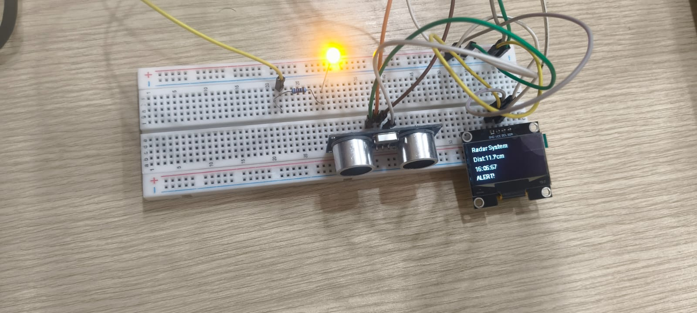
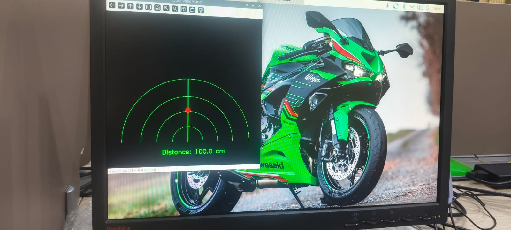

# Raspberry Pi Ultrasonic Radar System

## 📡 Real-Time Distance Detection & Radar Visualization

A Raspberry Pi-based ultrasonic radar system that measures the distance of nearby objects using an HC-SR04 ultrasonic sensor and displays the measured distance on an SSD1306 OLED. The system also provides a computer-based radar visualization with a real-time detection indicator.

## 📸 Project



The prototype was built and tested using a Raspberry Pi, HC-SR04 ultrasonic sensor, SSD1306 OLED display, LED indicator, breadboard, and jumper wires.

## ✨ Features

- 📏 Real-time ultrasonic distance measurement
- 📺 Distance display on SSD1306 OLED
- 🖥️ Computer-based radar visualization
- 🔴 Visual object detection indicator
- 💡 LED alert for nearby objects
- ⚡ Raspberry Pi GPIO-based control
- 🐍 Python-based implementation

## 🔧 Hardware Used

- Raspberry Pi
- HC-SR04 Ultrasonic Sensor
- SSD1306 OLED Display (I2C)
- LED
- Resistor
- Breadboard
- Jumper wires

## 💻 Software Used

- Python 3
- Raspberry Pi GPIO
- SSD1306 OLED library
- OpenCV / graphical visualization
- Linux / Raspberry Pi OS

## ⚙️ How It Works

1. The HC-SR04 sensor sends an ultrasonic pulse.
2. The echo signal is received by the Raspberry Pi.
3. The travel time of the ultrasonic wave is measured.
4. The distance is calculated from the measured time.
5. The distance is displayed on the OLED.
6. The computer displays the measurement using a radar-style visualization.
7. An LED alert is activated when an object is within the configured detection range.

## 🖥️ Radar Visualization



The radar interface provides a visual representation of the detected object and its measured distance.

## 🎥 Demonstration

A working demonstration video is available in the project repository / project documentation.

## 📂 Project Files

```text
radar_system.py    - Main Python program
wiring.md          - Hardware wiring information
README.md          - Project documentation
LICENSE            - MIT License
